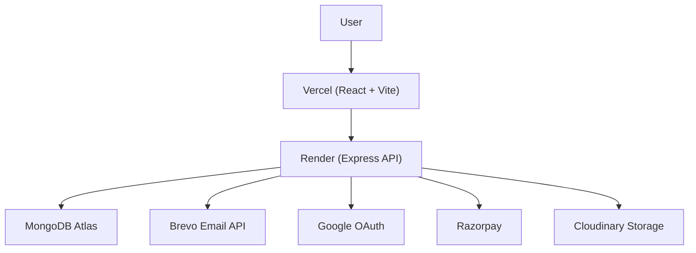

# Dynamic Ticks - Luxury Horology E-Commerce ⌚

---

Dynamic Ticks is a premium, full-stack MERN (MongoDB, Express, React, Node.js) e-commerce application designed specifically for high-end luxury watches. It features a highly bespoke, glassmorphism-inspired "luxury" aesthetic, complex multi-tier employee routing, and robust end-to-end purchasing flows.

---

## 🌐 Live Demo

Frontend (Vercel)
https://dynamic-ticks.vercel.app

Backend (Render)
https://dynamic-ticks.onrender.com

---

## 🌟 Key Features & Functionalities

### 1. Distinctive Premium UI/UX
- **Modern Aesthetic:** Bespoke, minimalist monochromatic design with tailored luxury accents and smooth micro-animations.
- **Glassmorphism:** Elegant use of transparency and blur effects for a premium feel.
- **Responsive Architecture:** Optimized for desktop, tablet, and mobile devices.
- **Interactive Elements:** Subtle hover effects and transitions that mimic a high-end retail experience.

### 2. Multi-tier Authentication & Security
- **JWT-Based Authentication:** Secure, cookie-based session management for persistent logins.
- **OTP Verification:** Integrated email-based OTP verification using Nodemailer for secure account activation.
- **Google OAuth 2.0:** Integrated "Continue with Google" flow for seamless customer onboarding.
- **Role-Based Access Control (RBAC):** Distinct portals and permissions for:
  - **👑 Admins:** Full control over the platform, users, and global settings.
  - **💼 Managers:** Product and inventory management, sales reporting.
  - **🛠️ Staff:** Order fulfillment, review moderation, and customer support.
  - **🚚 Delivery Agents:** Status updates, route management, and delivery confirmation.
  - **👤 Customers:** Personal accounts, purchase history, and wishlists.

### 3. Progressive Security & Auth
- **Resend OTP Cooldown:** Intelligent 60-second timer on OTP requests to prevent spam.
- **COOP Security:** Hardened frontend security with Cross-Origin-Opener-Policy to protect authentication popups.
- **Encrypted Data:** All sensitive information is hashed using industry-standard bcrypt.

### 4. Order & Fulfillment Management
- **Order Lifecycle:** Track orders from *Pending* ➔ *Picked* ➔ *Out for Delivery* ➔ *Delivered*.
- **Delivery Timeline Management:** Staff and Admins can set estimated delivery dates. Enforces an "Early, Not Delayed" rule.
- **Flexible Shipping:** Customers can update their shipping address until the product is "Out for Delivery".

### 5. Advanced E-Commerce Core
- **Razorpay Integration:** Secure, end-to-end payment gateway implementation.
- **Inventory Tracking:** Automated stock management and low-stock alerts.
- **Feedback Engine:** Detailed customer reviews with aggregate star ratings.
- **Returns & Exchanges:** Integrated portal for handling product returns.

---

## 🔐 Login Credentials (Demo Accounts)

To explore the different roles, you can use the following pre-configured accounts:

| Role | Email Address | Password |
| :--- | :--- | :--- |
| **System Admin** | `admin@dynamicticks.com` | `password123` |
| **Store Manager** | `manager@dynamicticks.com` | `password123` |
| **Store Staff** | `staff@dynamicticks.com` | `password123` |
| **Delivery Agent** | `delivery@dynamicticks.com` | `password123` |
| **Premium User** | `mitsheth2@gmail.com` | `password123` |

> [!IMPORTANT]
> To reset the database and re-initialize these accounts, run `node resetDB.js` in the `backend/` directory.

---

## 🛠️ Technology Stack

- **Frontend:** React.js (Vite), Tailwind CSS, Redux Toolkit, Lucide React.
- **Backend:** Node.js, Express.js.
- **Database:** MongoDB & Mongoose.
- **Payments:** Razorpay SDK.
- **Email:** Nodemailer.
- **Security:** JWT, bcryptjs, Google OAuth, COOP Headers.
- **Media Storage:** Cloudinary (via `multer-storage-cloudinary`).

---

## 🏗️ Technical Architecture

This project follows a strict **Feature-Based Modular MVC** structure on the backend and a **Role-Based** directory pattern on the frontend to ensure maintainability at scale.

### Backend (Modular MVC)
- **`backend/modules/`**: Each feature (Auth, Product, Order, etc.) encapsulates its own Model, Controller, and Routes.
- **`backend/middleware/`**: Centralized authentication and file upload logic.
- **`backend/utils/`**: Shared services like email delivery and common utilities.

### Frontend (Role-Based)
- **`frontend/src/pages/`**: Views are organized by user permissions:
  - `admin/`: Site-wide management.
  - `customer/`: Core shopping and account pages.
  - `employee/`: Dashboards for Managers, Staff, and Delivery.
  - `common/`: Public informational pages (About, Contact).
- **`frontend/src/services/`**: Abstracted API layer for centralized backend communication.

---

## 🚀 Getting Started

### 1. Prerequisites
- [Node.js](https://nodejs.org/) (LTS version)
- MongoDB instance (Local or Atlas)
- Razorpay API keys (for payments)

### 2. Installation
```bash
# Clone the repository
git clone https://github.com/Meetsheth25/Dynamic-Ticks.git
cd Dynamic-Ticks

# Install Backend dependencies
cd backend
npm install

# Install Frontend dependencies
cd ../frontend
npm install
```

### 3. Environment Setup
Create a `.env` file in the `backend/` directory:
```env
PORT=5000
NODE_ENV=development
MONGO_URI=your_mongodb_uri
JWT_SECRET=your_secret_key
EMAIL_HOST=smtp.gmail.com
EMAIL_PORT=587
EMAIL_USER=your_email@gmail.com
EMAIL_PASS=your_app_password
GOOGLE_CLIENT_ID=your_google_client_id
GOOGLE_CLIENT_SECRET=your_google_client_secret
RAZORPAY_KEY_ID=your_razorpay_key_id
RAZORPAY_KEY_SECRET=your_razorpay_secret
CLOUDINARY_CLOUD_NAME=your_cloudinary_cloud_name
CLOUDINARY_API_KEY=your_cloudinary_api_key
CLOUDINARY_API_SECRET=your_cloudinary_api_secret
```

### 4. Initialize Database
```bash
cd backend
node resetDB.js
```

### 5. Running the App
**Backend:**
```bash
cd backend
npm run dev
```

**Frontend:**
```bash
cd frontend
npm run dev
```

---

## 🚀 Deployment

- Frontend is deployed on Vercel.
- Backend API is deployed on Render.
- MongoDB Atlas is used as the production database.
- Cloudinary is used to store and serve product images.
- Environment variables are configured separately on Vercel and Render.
- Frontend communicates with the backend using VITE_API_URL.

### Deploying to Render
1. Log in to your Render Dashboard.
2. Select your Web Service.
3. Go to the **Environment** settings.
4. Add the following keys:
   - `CLOUDINARY_CLOUD_NAME`
   - `CLOUDINARY_API_KEY`
   - `CLOUDINARY_API_SECRET`
5. Save changes and trigger a manual redeployment.

---

## ⚙️ Production Environment Variables

### Backend (Render)

```env
PORT=
NODE_ENV=production
MONGO_URI=
JWT_SECRET=
BREVO_API_KEY=
EMAIL_FROM=
GOOGLE_CLIENT_ID=
GOOGLE_CLIENT_SECRET=
RAZORPAY_KEY_ID=
RAZORPAY_KEY_SECRET=
CLOUDINARY_CLOUD_NAME=
CLOUDINARY_API_KEY=
CLOUDINARY_API_SECRET=
```

### Frontend (Vercel)

```env
VITE_API_URL=
VITE_GOOGLE_CLIENT_ID=
```

---

## 📦 Deployment Architecture



---

## 🔒 Production Security

- JWT Authentication
- Password hashing using bcrypt
- Google OAuth
- Email OTP verification using Brevo
- Environment variables
- Protected API routes
- Role-based authorization
- HTTPS deployment

---

## 📈 Deployment Status

[](https://dynamic-ticks.vercel.app)
[](https://dynamic-ticks.onrender.com)
[](https://www.mongodb.com/cloud/atlas)

---

## 🧪 Production Ready Features

- Production Deployment
- Secure Authentication
- Responsive UI
- Role-Based Access
- Email OTP Verification
- Google Login
- Payment Gateway
- Order Management

---

## 📜 License
This project is for educational purposes. Feel free to use the code for your own learning or projects.

---
Driven by passion. Powered by code.
— Meet Sheth
